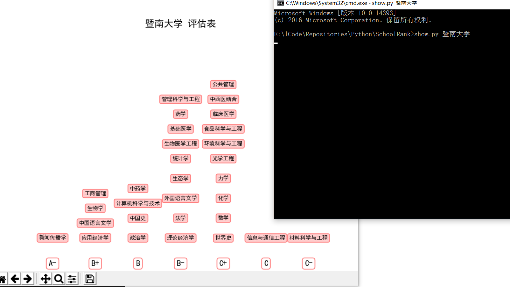
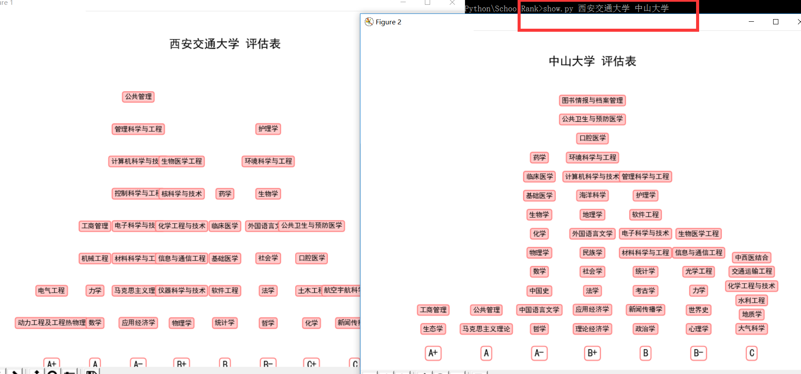
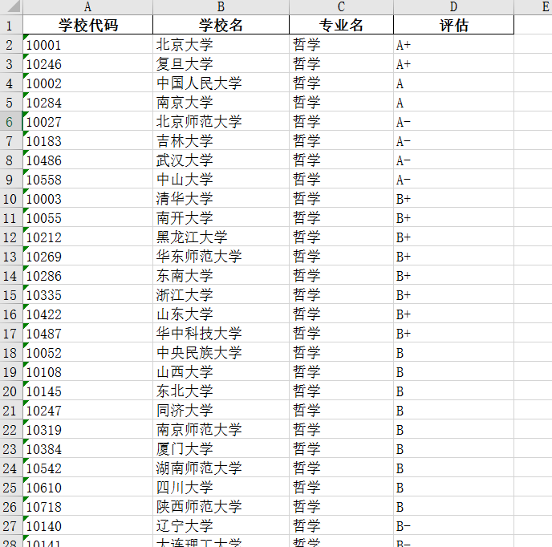
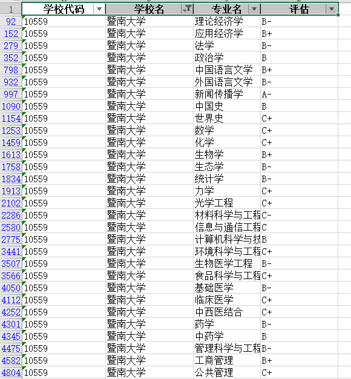
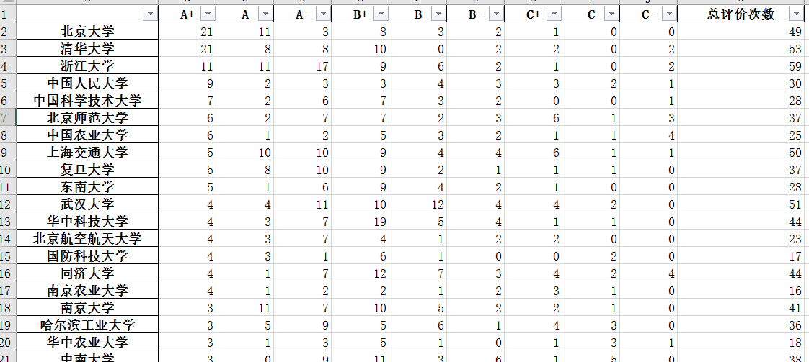
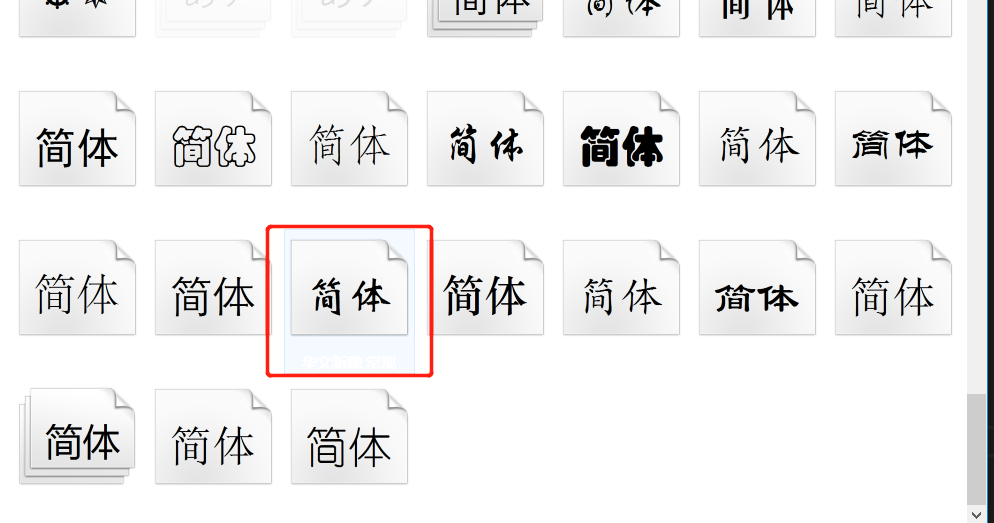

# SchoolRank


[**博客查看本文: https://vonsdite.cn/posts/92d0ece7.html**](https://vonsdite.cn/posts/92d0ece7.html)

## 数据来源
1. 中国学位与研究生教育信息网 => http://www.cdgdc.edu.cn/xwyyjsjyxx/xkpgjg/

2. 数据是全国**第四轮**学科评估结果，该数据于**2017年12月28日**发布

## 目的
做这个脚本的缘由, 
1. 因为身边总有同学要讨论哪个高校哪个高校**比较优秀**, 讲道理, 要看哪个高校优秀, 还是要具体到高校的**具体专业**, 口说无凭, 数据说话
2. 可以方便大家知道某个高校的强势在哪里

## 脚本介绍

### 需要的第三方库
> - **wordcloud**: `pip install wordcloud`
> - **pandas**: `pip install pandas`
> - **numpy**: `pip install numpy`
> - **matplotlib**: `pip install matplotlib`
> - **pillow**: `pip install pillow`
> - **requests**: `pip install requests`
> - **BeautifulSoup**: `pip install beautifulsoup4`

### `show.py`
_展示学校的评估结果_

#### 使用
1. 在该**项目目录下**打开终端
2. 键入 `show.py [学校名]` 即可

比如, 
`show.py 暨南大学`


如果想比较**多个学校**之间的评估结果, 可以这样操作
`show.py 西安交通大学 中山大学`



### `GetSomeData/GetSchoolRank.py`
_用于获取高校评估的脚本_

使用爬虫来获取 **全国第四轮学科评估结果**, 将数据保存为了 `schoolRank.xlsx`, 保存为`.xlsx`文件是为了方便使用`excel`进行操作(也可以自己保存为`.csv`文件来进行数据处理, 代码中已注释)


#### schoolRank.xlsx数据展示


可以通过`excel`来筛选查看数据(比自己造轮子来的方便多了)

**比如,** 查看 **暨南大学**的评估结果


### `GetSomeData/AssessmentAnalysis.py`
_用于统计每个学校得到各个评估的次数_

通过`pandas`简易处理下数据, 将数据保存为了 `schoolRank.xlsx`, 保存为`.xlsx`文件是为了方便使用`excel`进行操作(也可以自己保存为`.csv`文件来进行数据处理, 代码中已注释)


#### schoolAssementCount.xlsx数据展示


同样可以通过`excel`来筛选查看数据

### `GetSomeData/GetWordCloud.py`
_以`schoolRank.xlsx`中的学校名来作词云, 实际就是按学校参加评估的总次数来画词云_

该项目生成的词云如下:


##### 注意
**注意1**
`wordcloud` 不支持显示中文, 可以通过如下修改来支持中文:
1. 进入`python`根目录, 然后进入`Lib\site-packages\wordcloud`
2. 进入`C:\Windows\Fonts`目录下, 拷贝一个中文字库, 如**华文新魏**, 将其复制粘贴到`Lib\site-packages\wordcloud`目录下


3. 打开`Lib\site-packages\wordcloud`目录下`wordcloud.py`, 找到如下这行代码

将代码改为对应拷入进来的字库名字, 如**华文新魏**的字库名字为**STXINWEI.TTF**

4. 至此解决中文乱码问题

**注意2**
`wordcloud`的`WordCloud`类中的`generate`方法是先对传进去的文字进行分词, 但是对**中文的分词效果**不太好, 建议先自己计算词频, 存放到字典中, 然后使用`generate_from_frequencies`来生成词云
```python {cmd=True}
from wordcloud import WordCloud
import matplotlib as mpl
import matplotlib.pyplot as plt
mpl.rcParams['font.sans-serif'] = ['SimHei']    # 指定默认字体 SimHei为黑体
mpl.rcParams['axes.unicode_minus'] = False      # 用来正常显示负号

text = '清华大学清华大学北京大学北京大学暨南大学'
textDic = {
    '清华大学': 2,
    '北京大学': 2,
    '暨南大学': 1
}
wc1 = WordCloud().generate(text)                        # generate对中文分词效果不好
wc2 = WordCloud().generate_from_frequencies(textDic)    # 自己来计算词频, 改善效果

plt.title('generate生成的词云')
plt.imshow(wc1, interpolation="bilinear")
plt.axis("off")

plt.figure()
plt.title('自己计算词频')
plt.imshow(wc2, interpolation="bilinear")
plt.axis("off")
plt.show()
```


